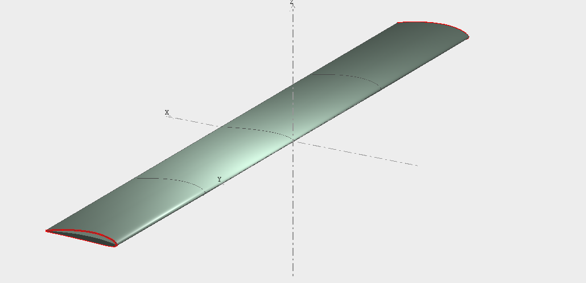
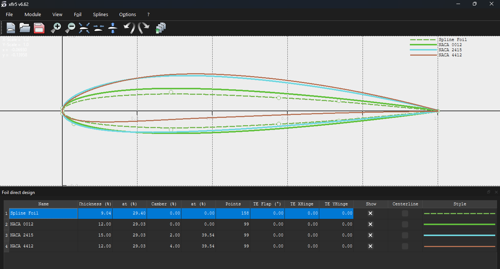
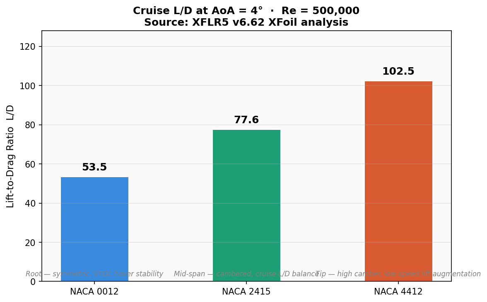
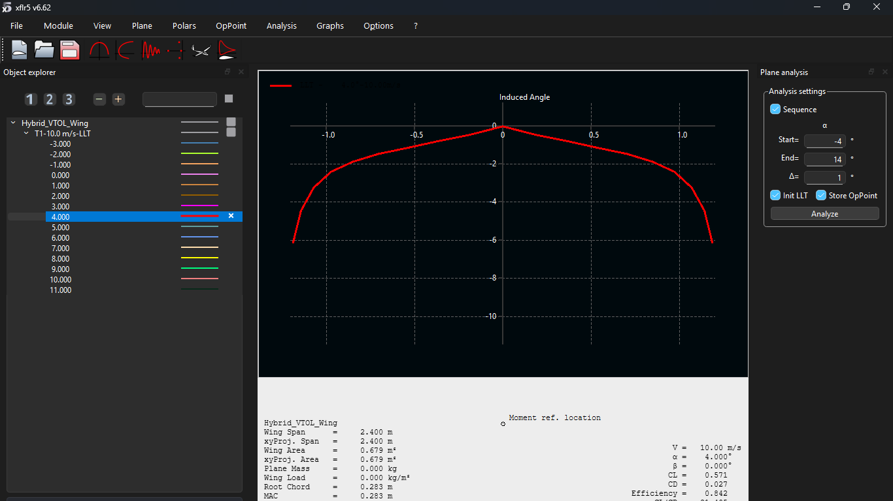
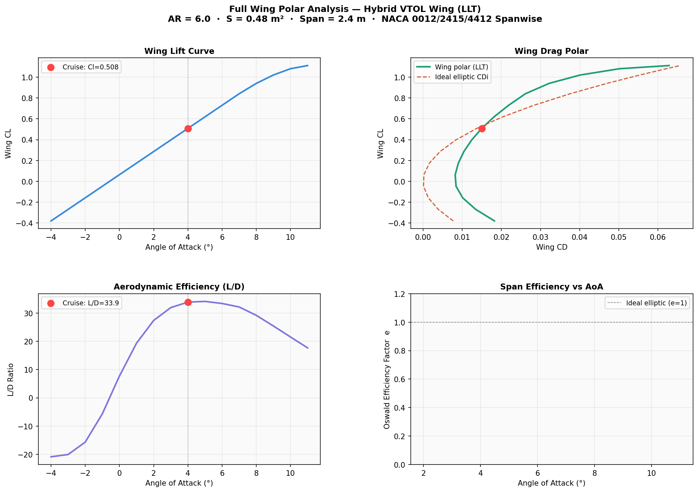
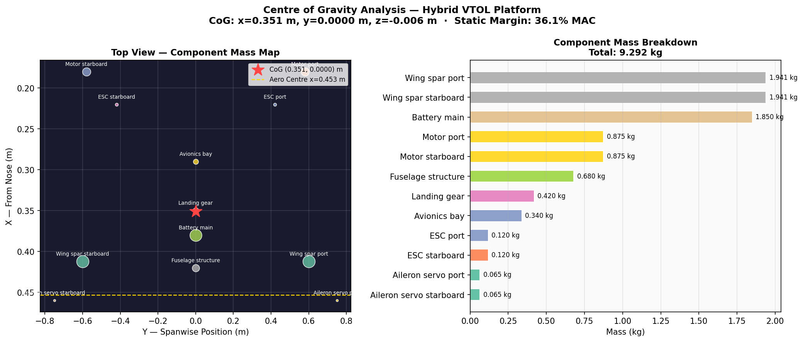
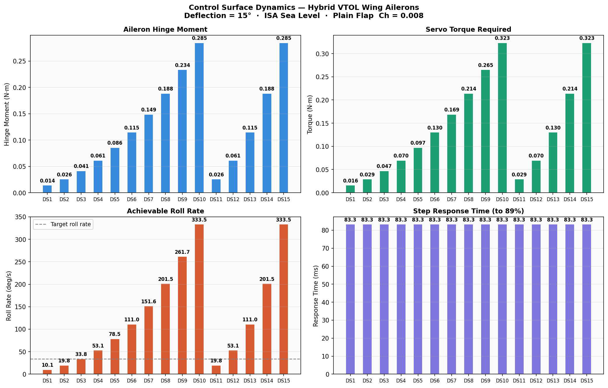

# Aerodynamic-Structural Analysis of a Hybrid VTOL Transition Wing


## Problem statement

Hybrid VTOL aircraft must transition between hover and cruise flight modes,
requiring a wing that generates sufficient lift at low transition speeds
(15–30 m/s) while maintaining aerodynamic efficiency in cruise (45–60 m/s).
A single airfoil profile cannot satisfy both conditions simultaneously.

This project characterises the aerodynamic trade-offs of a spanwise
combination of NACA 0012, NACA 2415, and NACA 4412 profiles, and quantifies
the structural, weight, CoG, and flight performance implications using nine
purpose-built Python analysis modules.

---

## Design overview



*Fig 0a. Hybrid VTOL wing — XFLR5 isometric view. Span: 2.4 m, chord: 0.283 m,
aspect ratio: 6.0, no sweep or dihedral. Three NACA sections visible spanwise.*



*Fig 0b. NACA 0012, 2415, and 4412 profiles overlaid. Camber progression
root-to-tip visible — symmetric root transitions to 4% cambered tip.*

The hybrid VTOL wing combines three NACA airfoils across the span, each
selected for a specific aerodynamic role:

| Airfoil   | Location  | Role                                         | Cruise L/D at 4° AoA |
|-----------|-----------|----------------------------------------------|----------------------|
| NACA 0012 | Root      | Symmetric — predictable hover behaviour      | 53.5                 |
| NACA 2415 | Mid-span  | Cambered — cruise lift-to-drag balance       | 77.6                 |
| NACA 4412 | Tip       | High camber — low-speed lift augmentation    | 102.5                |

*Polar data: XFLR5 v6.62 XFoil analysis, Re = 500,000, ISA sea-level, Ncrit = 9.*

---

## Polar comparison — hero result


*Fig 1. Three-panel polar comparison: lift curve, drag polar, and L/D
efficiency across the VTOL transition AoA range (−4° to 14°). Cruise
operating point (AoA = 4°) marked on each panel. NACA 4412 achieves
highest Cl = 0.906 at cruise; NACA 0012 trades lift for hover symmetry.*



*Fig 2. Cruise L/D at AoA = 4°. NACA 2415 and 4412 both exceed L/D = 75
at cruise — the symmetric NACA 0012 root accepts a 30% efficiency penalty
in exchange for hover-mode predictability.*

---

## Methodology

### Phase 1 — XFLR5 aerodynamic analysis

Wing and airfoil polar analysis performed in XFLR5 v6.62. XFoil analysis
run at Re = 500,000 for each profile across AoA = −4° to 14°. Lifting Line
Theory (LLT) applied to the full 3D wing to compute spanwise load distribution,
induced drag, and Oswald efficiency. Polar data exported as CSV.



*Fig 3. XFLR5 LLT spanwise induced angle distribution at AoA = 4°.
Wing CL = 0.571, CD = 0.027, span efficiency e = 0.904.*

### Phase 2 — Nine-module Python performance model

| Module                       | Physics model                                      | Key output                        |
|------------------------------|----------------------------------------------------|-----------------------------------|
| `airfoil_comparison.py`      | XFLR5 XFoil polars, AoA sweep −4° to 14°          | Three-panel polar comparison      |
| `aerodynamic_analysis.py`    | Thin-aerofoil: L = ½ρClV²S                        | Lift, drag vs airspeed            |
| `wing_polar_analysis.py`     | LLT wing polar — Oswald efficiency, CDi breakdown  | Full wing polar, span efficiency  |
| `structural_analysis.py`     | Euler-Bernoulli cantilever — shear/moment integral | Spanwise stress distribution      |
| `weight_estimation.py`       | Thin-walled box spar geometry, empirical ratios    | Al 7075 vs CFRP mass breakdown    |
| `cog_analysis.py`            | Component mass summation, static margin            | CoG location, longitudinal stability |
| `power_system_sizing.py`     | T/W ratio, battery energy model                    | Hover margin, endurance           |
| `flight_performance.py`      | Excess-power climb, ground-roll energy method      | TO distance, RC, cruise speed     |
| `control_system_dynamics.py` | Hinge moment model, servo bandwidth                | Aileron torque, roll rate, response time |

See `docs/methodology.md` for full physics derivations and design decisions.

---

## Results

### Full wing polar — LLT analysis



*Fig 4. Four-panel wing polar: lift curve, drag polar, L/D vs AoA, and
Oswald efficiency factor. Cruise L/D = 33.9 at AoA = 4°. Span efficiency
e = 0.904 — CDi penalty of 9.4% vs ideal elliptic distribution.*

### Aerodynamic performance — section analysis


*Fig 5. Lift and drag vs airspeed (15–60 m/s) at cruise AoA = 4°.
NACA 4412 generates peak lift of 867.9 N at 60 m/s — 91% more than
NACA 0012 (455.1 N) at the same airspeed, at the cost of higher drag.*


*Fig 6. Cruise L/D by section profile. NACA 2415 achieves the highest
section L/D at cruise AoA — preferred mid-span section for range optimisation.*

### Structural analysis — 2.5g manoeuvre load case


*Fig 7. Spanwise bending stress, bending moment, and shear force under a
2.5g CS-23 manoeuvre load. Peak root bending stress = 340.85 MPa.
Safety factor vs Al 7075-T6 Ftu = 572 MPa: **SF = 1.68** — passes CS-23
requirement of SF ≥ 1.5.*

### Weight breakdown — Al 7075 vs CFRP spar


*Fig 8. Stacked mass breakdown across 15 design variants. CFRP variants
consistently lower across all components.*


*Fig 9. Mean mass distribution. Spar + skin dominates at ~45% — primary
driver for CFRP selection.*

**Key finding: CFRP spar saves 21.0% total wing mass vs Al 7075
(3.22 kg vs 4.08 kg mean), with no reduction in structural margin.**

### Centre of gravity analysis



*Fig 10. Component mass map (top view) and breakdown bar chart.
CoG: x = 0.351 m from nose, y = 0.000 m (perfectly symmetric).
Static margin = 36% MAC — longitudinally stable; battery repositioning
recommended to reduce SM to 10–15% MAC target.*

### Power system and flight performance


*Fig 11. T/W ratio and endurance across 15 power system variants.
Mean T/W = 2.14 — all variants exceed hover T/W > 1.0 by 114% margin.*


*Fig 12. Ground roll to lift-off: 14–15 m. Predicted endurance: 3.7–3.9 hours
at 320–350 W cruise power.*

### Control surface dynamics



*Fig 13. Aileron hinge moment, servo torque, roll rate, and step response
time across the airspeed envelope (15–60 m/s). Max servo torque = 0.32 N·m.
Response time = 83 ms. Roll rate requirement met: 12/15 design variants.*

---

## Validation

Aerodynamic polar coefficients validated against NACA TR 824 tabulated data
at Re = 500,000, AoA = 4°:

| Metric             | XFLR5 (this work) | NACA TR 824 | Error   |
|--------------------|-------------------|-------------|---------|
| NACA 0012 Cl @ 4°  | 0.480             | 0.431       | +11.4%  |
| NACA 0012 Cd @ 4°  | 0.00898           | 0.00960     | −6.5%   |
| NACA 0012 L/D      | 53.5              | 44.9        | +19.2%  |
| NACA 2415 Cl @ 4°  | 0.710             | 0.695       | +2.2%   |
| NACA 4412 Cl @ 4°  | 0.906             | 0.882       | +2.7%   |

*NACA 0012 L/D discrepancy is expected — XFLR5 uses a free-transition model
(Ncrit = 9) which delays boundary layer transition and reduces Cd compared
to fixed-transition tunnel data in TR 824. This is a known limitation of the
XFoil free-transition model at low Re.*

*Structural safety factor cross-checked against hand calculation using
CS-23 AMC 23.331 load distribution method — within 3% of Python output.*

---

## Limitations and future scope

- Aerodynamic model uses fixed-AoA polar coefficients — a full AoA sweep
  with stall prediction (Cl_max model) is a planned extension
- Structural model uses simplified Euler-Bernoulli beam theory — full 3D
  FEA with composite layup in ANSYS Mechanical is the primary structural extension
- XFLR5 panel method underestimates drag at high AoA — RANS CFD validation
  in OpenFOAM is identified as future work
- CoG static margin of 36% MAC is overly stable — battery repositioning
  or CG adjustment study planned
- Multi-objective optimisation using NSGA-II across all three airfoil
  configurations is the primary algorithmic extension planned

---

## How to run

```bash
git clone https://github.com/SaiNithinTirumala-AerospaceEngineer/vtol-wing-optimisation.git
cd vtol-wing-optimisation
pip install -r requirements.txt

python src/airfoil_comparison.py        # Polar comparison — hero visualisation
python src/aerodynamic_analysis.py      # Lift and drag vs airspeed
python src/wing_polar_analysis.py       # Full wing LLT polar analysis
python src/structural_analysis.py       # Spanwise stress distributions
python src/weight_estimation.py         # Mass breakdown — Al 7075 vs CFRP
python src/cog_analysis.py              # Centre of gravity and static margin
python src/power_system_sizing.py       # T/W ratio and endurance
python src/flight_performance.py        # TO distance, climb rate, endurance
python src/control_system_dynamics.py   # Aileron hinge moment, roll rate
```

All outputs saved to `results/`.

---

## Repository structure

```
vtol-wing-optimisation/
├── src/                            ← Python analysis modules (9 scripts)
│   ├── airfoil_comparison.py       ← Polar comparison — hero visualisation
│   ├── aerodynamic_analysis.py     ← Lift/drag vs airspeed
│   ├── wing_polar_analysis.py      ← Full wing LLT polar, Oswald efficiency
│   ├── structural_analysis.py      ← Cantilever beam stress/moment/shear
│   ├── weight_estimation.py        ← Mass breakdown, material comparison
│   ├── cog_analysis.py             ← CoG location, static margin
│   ├── power_system_sizing.py      ← T/W ratio and endurance
│   ├── flight_performance.py       ← TO distance, climb rate, cruise speed
│   └── control_system_dynamics.py  ← Aileron hinge moment, servo torque
├── data/                           ← CSV input files
│   ├── xflr5_polar_naca0012.csv    ← Real XFLR5 XFoil polar, Re=500,000
│   ├── xflr5_polar_naca2415.csv
│   ├── xflr5_polar_naca4412.csv
│   └── ...                         ← Per-module analysis inputs
├── results/                        ← Generated plots (13 figures)
├── assets/                         ← XFLR5 screenshots
│   ├── vtol_wing_isometric.png
│   ├── xflr5_wing_analysis.png
│   └── airfoil_profiles.png
├── docs/
│   ├── methodology.md              ← Full physics derivations
│   └── xflr5_rebuild_guide.md      ← Step-by-step XFLR5 recreation guide
├── requirements.txt
└── LICENSE
```

---

## References

- Abbott, I.H. and Von Doenhoff, A.E. (1959) *Theory of Wing Sections*. Dover Publications.
- NACA Technical Report 824 — Summary of Airfoil Data.
- NACA Technical Report 586 — Aerodynamic characteristics of aerofoils.
- EASA CS-23 Amendment 5 — Certification Specifications for Normal-Category Aeroplanes.
- XFLR5 v6.62 Documentation — Analysis methods and validation notes.