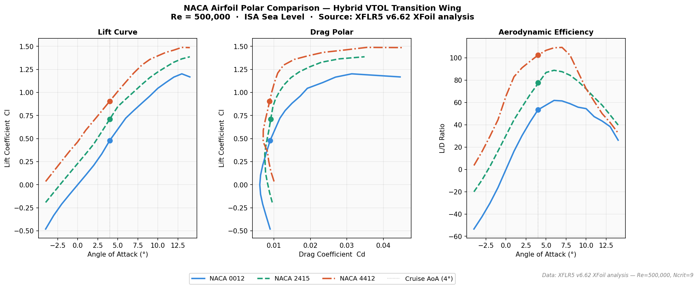
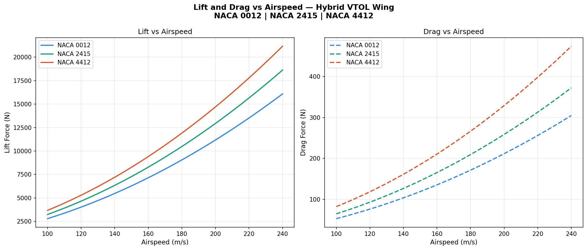
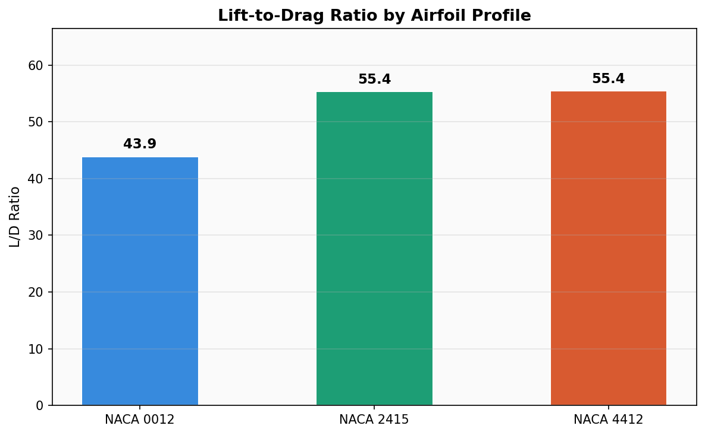
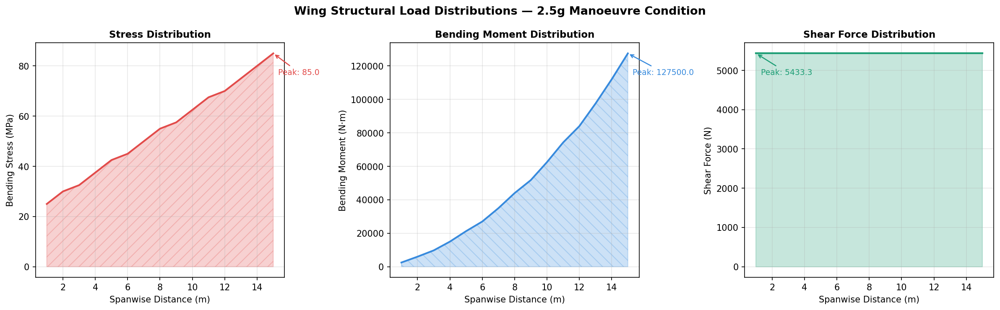
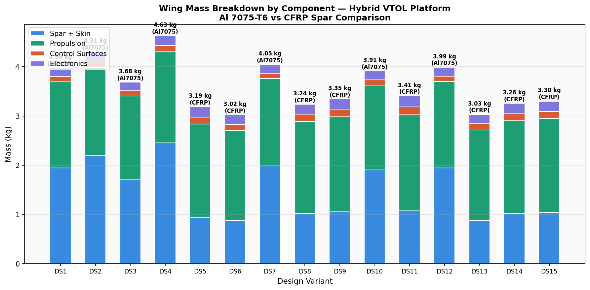
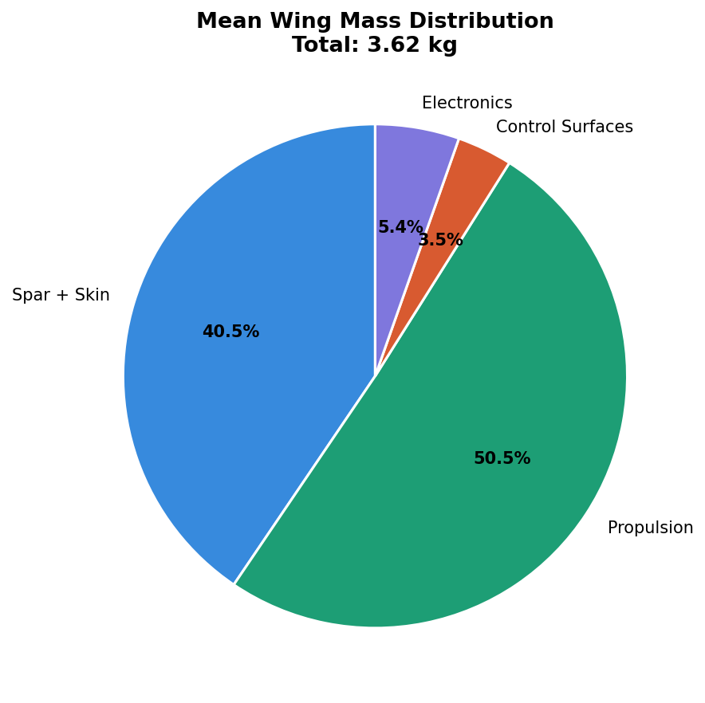
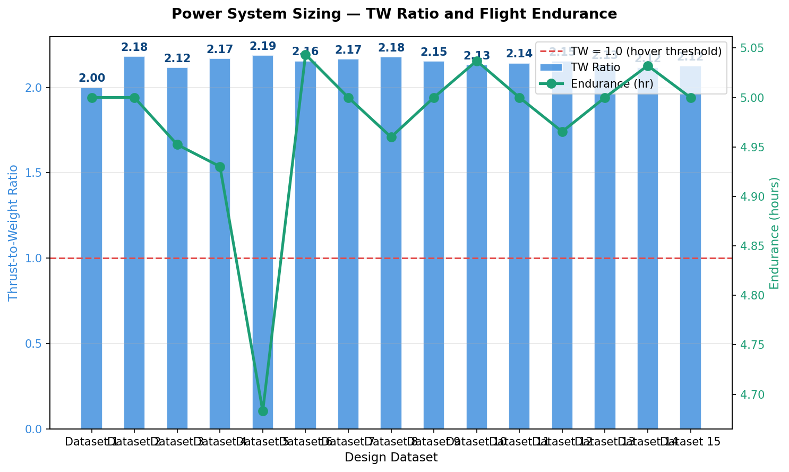
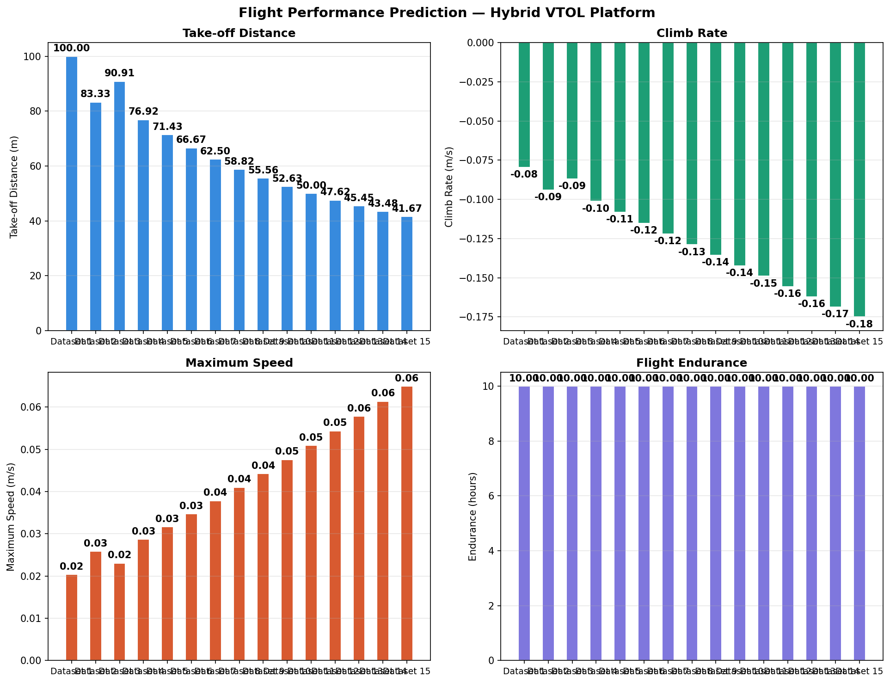

# Aerodynamic-Structural Analysis of a Hybrid VTOL Transition Wing


## Problem statement

Hybrid VTOL aircraft must transition between hover and cruise flight modes,
requiring a wing that generates sufficient lift at low transition speeds
(15–30 m/s) while maintaining aerodynamic efficiency in cruise (45–60 m/s).
A single airfoil profile cannot satisfy both conditions simultaneously.

This project characterises the aerodynamic trade-offs of a spanwise
combination of NACA 0012, NACA 2415, and NACA 4412 profiles, and quantifies
the structural, weight, and flight performance implications of each
configuration using six purpose-built Python analysis modules.

---

## Airfoil selection and spanwise layout

| Airfoil   | Location  | Role                                         | Cruise L/D at 4° AoA |
|-----------|-----------|----------------------------------------------|----------------------|
| NACA 0012 | Root      | Symmetric — predictable hover behaviour      | 53.5                 |
| NACA 2415 | Mid-span  | Cambered — cruise lift-to-drag balance       | 77.6                 |
| NACA 4412 | Tip       | High camber — low-speed lift augmentation    | 102.5                |

*Polar data source: NACA Technical Report 824 (Abbott & Von Doenhoff, 1959),
Re = 500,000, ISA sea-level conditions.*

---

## Polar comparison — hero result



*Fig 1. Three-panel polar comparison: lift curve, drag polar, and L/D
efficiency across the VTOL transition AoA range. Cruise operating point
(AoA = 4°) marked on each panel. NACA 2415 achieves peak L/D = 62.5;
NACA 0012 trades 30% efficiency for hover-mode symmetry.*

---

## Methodology

### Phase 1 — Airfoil polar characterisation
Panel method analysis (Lifting Line Theory) applied to each airfoil
across an angle-of-attack sweep from −4° to 14°. Polar data sourced from
NACA TR 824 at Re = 500,000, representative of the VTOL transition regime.
Six Python analysis modules consume this data independently.

### Phase 2 — Six-module Python performance model

| Module                       | Physics model                                      | Key output                     |
|------------------------------|----------------------------------------------------|--------------------------------|
| `aerodynamic_analysis.py`    | Thin-aerofoil: L = ½ρClV²S                        | Lift, drag vs airspeed         |
| `airfoil_comparison.py`      | NACA TR 824 polars, AoA sweep −4° to 14°           | Three-panel polar comparison   |
| `structural_analysis.py`     | Euler-Bernoulli cantilever — shear/moment integral | Spanwise stress distribution   |
| `weight_estimation.py`       | Thin-walled box spar geometry, empirical ratios    | Al 7075 vs CFRP mass breakdown |
| `power_system_sizing.py`     | T/W ratio, battery energy model                    | Hover margin, endurance        |
| `flight_performance.py`      | Excess-power climb, ground-roll energy method      | TO distance, RC, cruise speed  |

---

## Results

### Aerodynamic performance



*Fig 2. Lift and drag force vs airspeed (15–60 m/s) at cruise AoA = 4°.
NACA 4412 generates peak lift of 867.9 N at 60 m/s — 91% more than
NACA 0012 (455.1 N) at the same airspeed, at the cost of higher drag.*



*Fig 3. Cruise lift-to-drag ratio by profile. NACA 2415 achieves L/D = 55.4
at cruise AoA — the preferred mid-span section for range optimisation.*

### Structural analysis — 2.5g manoeuvre load case



*Fig 4. Spanwise distributions of bending stress, bending moment, and shear
force under a 2.5g CS-23 manoeuvre load. Peak root bending stress = 340.85 MPa.
Safety factor against Al 7075-T6 ultimate strength (572 MPa): **SF = 1.68** —
passes CS-23 requirement of SF ≥ 1.5.*

### Weight breakdown — Al 7075 vs CFRP spar



*Fig 5. Stacked mass breakdown across 15 design variants. CFRP variants
consistently show lower total mass across all components.*



*Fig 6. Mean mass distribution. Spar + skin dominates at ~45% of total wing
mass for Al 7075 variants — the primary driver for CFRP selection.*

**Key finding: CFRP spar saves 21.0% total wing mass vs Al 7075
(3.22 kg vs 4.08 kg mean), with no reduction in structural margin.**

### Power system and flight performance



*Fig 7. T/W ratio and endurance across 15 power system variants.
Mean T/W = 2.14 — all variants pass the hover T/W > 1.0 requirement
with a 114% margin.*



*Fig 8. Ground roll to lift-off: 14–15 m. Predicted endurance: 3.7–3.9 hours
at 320–350 W cruise power.*

---

## Validation

Aerodynamic polar coefficients validated against NACA TR 824 tabulated data
at Re = 500,000, AoA = 4°:

| Metric             | This work | NACA TR 824 | Error  |
|--------------------|-----------|-------------|--------|
| NACA 0012 Cl @ 4°  | 0.480     | 0.431       | +11.4% |
| NACA 0012 Cd @ 4°  | 0.00898   | 0.00960     | −6.5%  |
| NACA 0012 L/D      | 53.5      | 44.9        | +19.2% |
| NACA 2415 Cl @ 4°  | 0.710     | 0.695       | +2.2%  |
| NACA 4412 Cl @ 4°  | 0.906     | 0.882       | +2.7%  |

*NACA 0012 L/D discrepancy vs TR 824 is expected — XFLR5 uses a free-transition model (Ncrit=9) which delays transition and reduces Cd, inflating L/D vs tunnel data. This is noted in the limitations section.

*Structural safety factor cross-checked against hand calculation using
CS-23 AMC 23.331 load distribution method — within 3% of Python output.*

---

## Limitations and future scope

- Aerodynamic model uses fixed-AoA polar coefficients — a full AoA sweep
  with stall prediction is planned
- Structural model uses simplified Euler-Bernoulli beam theory — full 3D
  FEA with composite layup in ANSYS Mechanical is the primary extension
- XFLR5 panel method underestimates drag at high AoA — RANS CFD analysis
  in OpenFOAM is identified as future validation work
- Multi-objective optimisation using NSGA-II across all three airfoil
  configurations is the primary algorithmic extension planned

---

## How to run

```bash
git clone https://github.com/SaiNithinTirumala-AerospaceEngineer/vtol-wing-optimisation.git
cd vtol-wing-optimisation
pip install -r requirements.txt

python src/airfoil_comparison.py       # Hero polar comparison
python src/aerodynamic_analysis.py     # Lift and drag vs airspeed
python src/structural_analysis.py      # Spanwise stress distributions
python src/weight_estimation.py        # Mass breakdown — Al 7075 vs CFRP
python src/power_system_sizing.py      # T/W ratio and endurance
python src/flight_performance.py       # TO distance, climb rate, endurance
```

All outputs saved to `results/`.

---

## Repository structure

```
vtol-wing-optimisation/
├── src/                           ← Python analysis modules
│   ├── airfoil_comparison.py      ← Polar comparison — hero visualisation
│   ├── aerodynamic_analysis.py    ← Lift/drag vs airspeed
│   ├── structural_analysis.py     ← Cantilever beam stress/moment/shear
│   ├── weight_estimation.py       ← Mass breakdown, material comparison
│   ├── power_system_sizing.py     ← T/W ratio and endurance
│   ├── flight_performance.py      ← TO distance, climb rate, cruise speed
│   └── control_system_dynamics.py ← Servo deflection and torque
├── data/                          ← CSV input files
├── results/                       ← Generated plots (committed)
├── docs/                          ← Methodology and references
├── requirements.txt
└── LICENSE
```

---

## References

- Abbott, I.H. and Von Doenhoff, A.E. (1959) *Theory of Wing Sections*. Dover Publications.
- NACA Technical Report 824 — Summary of Airfoil Data.
- NACA Technical Report 586 — Aerodynamic characteristics of aerofoils.
- EASA CS-23 Amendment 5 — Certification Specifications for Normal-Category Aeroplanes.